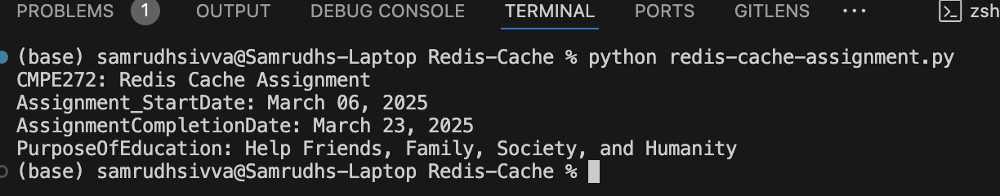
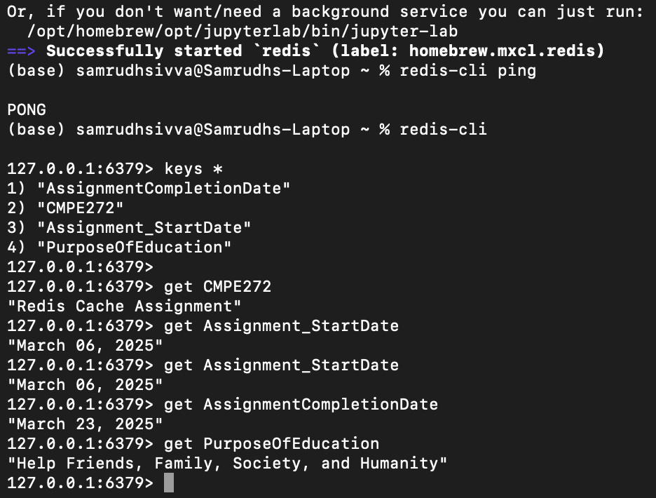

📄 Updated README.md
# CMPE272 - Redis Cache Assignment

## 🎯 Objective
Use Redis to cache application data and demonstrate insert & retrieve operations using Python.

---

## 🗂️ Cache Entries

| Key                     | Value                                               |
|------------------------|-----------------------------------------------------|
| CMPE272                | Redis Cache Assignment                              |
| Assignment_StartDate   | March 06, 2025                                      |
| AssignmentCompletionDate | March 23, 2025                                   |
| PurposeOfEducation     | Help Friends, Family, Society, and Humanity         |

---

## ⚙️ Setup & Run

### 1. Start Redis Server
```bash
redis-server
2. Install Required Python Package
pip install redis
3. Run Python Script
python redis_cache_assignment.py
📸 Screenshots

Create a folder called screenshots in your project directory and save your images there.
```


## 📥 Python Output Screenshot



## 📥 Redis CLI Screenshot


